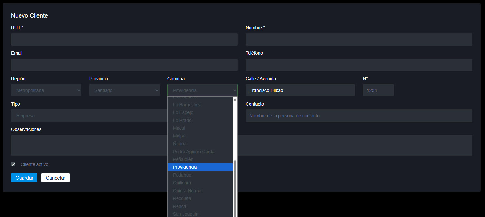

# Chile Region - Provincia - Comuna - Calle / Avenida

Menú condicional desplegable para Chile: **Región → Provincia → Comuna → Calle/Avenida**. Ideal para formularios de dirección, checkout o cualquier sistema que necesite ubicación en Chile.

---

## Demo



---

## Características

- ✅ Selecciones encadenadas automáticas
- ✅ Datos de todas las 16 regiones de Chile
- ✅ Incluye todas las provincias y comunas
- ✅ Calles/Avenidas desde archivos CSV
- ✅ Input con autocompletado (escribir o seleccionar)
- ✅ Datos extraídos desde OpenStreetMap

---

## Estructura

```
menu-condicional/
├── menu-condicional.php   # API
├── comunas.php        # Datos de regiones, provincias y comunas
├── region.csv       # Lista de regiones
├── Region/
│   ├── {region}/
│   │   ├── provincia.csv
│   │   ├── {provincia}/
│   │   │   ├── comuna.csv
│   │   │   └── calles_{comuna}.csv
```

---

## Uso

### Opción 1: Copiar el HTML

Simplemente usa el archivo `demo.html` como ejemplo.

### Opción 2: Integrar en PHP

```php
<?php include 'menu-condicional/menu-condicional.php'; ?>
```

Y en tu JavaScript:

```javascript
const apiUrl = 'menu-condicional.php?action=';
```

---

## Datos

| Métrica | Valor |
|---------|-------|
| Total de regiones | 16 |
| Total de provincias | ~50 |
| Total de comunas | ~346 |
| Archivos de calles CSV | 341 |
| Total de nombres de calles | ~135,000 |

---

## Origen de los Datos

Los nombres de calles fueron extraídos desde **OpenStreetMap (OSM)** y organizados por Región → Provincia → Comuna.

### Proceso de extracción:

1. Descargar archivo OSM de Chile desde [Geofabrik](https://download.geofabrik.de/south-america/chile.html)
2. Extraer nombres de calles usando `osmosis` o `osmconvert`
3. Separar por regiones/provincias/comunas
4. Limpiar duplicados y corregir acentos
5. Generar archivos CSV por comuna

### Formato de archivos CSV:

```csv
name
Avenida Libertador Bernardo O'Higgins
Andrés Bello
Calle Principal
...
```

---

## Tech Stack

- **PHP** - API
- **JavaScript** - Fetch API para cargar datos dinámicamente
- **HTML/CSS** - Interfaz responsive

---

## Licencia

- **Datos de calles**: [OpenStreetMap Contributors](https://www.openstreetmap.org/copyright) (ODbL)
- **Código**: MIT License

---

## Contribuir

¿Faltan calles o hay errores? 
1. Haz un fork
2. Crea una rama (`git checkout -b nueva-calle`)
3. Envía un pull request

---

## Ejemplo en vivo

Al seleccionar **Antofagasta → Tocopilla → María Elena**, se cargan automáticamente las calles de María Elena desde el archivo CSV correspondiente.